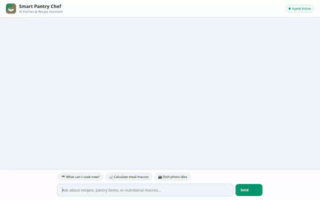

# Smart Pantry Chef — Your AI Kitchen Assistant

An intelligent, conversational AI assistant designed for home cooks to manage pantry inventory, discover real online recipes, calculate nutritional macros, find nearby grocery stores, consult traditional herbal remedies, and generate dish visuals.

Built using Google's Agent Development Kit (ADK) and deployed to Vertex AI Agent Runtime with a custom FastAPI chat interface.



---

## 🌟 Key Features & Tool Capabilities

### 🧠 Cross-Session Memory Bank
- **Memory Persistence:** Remembers user dietary preferences, food allergies, and cooking history across sessions using Vertex AI Memory Bank (`PreloadMemoryTool` and post-turn memory callbacks).
- **Allergy Enforcement:** Automatically filters out allergens from recipe suggestions and meal recommendations based on remembered profile details.

### 📦 Firestore Pantry Inventory
- **Real-Time Inventory Management:** Read, update, and remove ingredients stored in Google Cloud Firestore (`pantry_inventory` collection).
- **Automated Grocery List:** Saves missing recipe items directly into a Firestore `shopping_list` collection.

### 🍲 External Recipe Search API
- **TheMealDB Integration:** Fetches real-world recipe ideas, ingredients, and cooking instructions via TheMealDB REST API (`fetch_external_recipes`).

### 🗺️ Google Maps Geocoding & Places (New) APIs
- **Geocoding:** Converts addresses into latitude and longitude coordinates (`geocode_address`).
- **Nearby Places Search:** Finds nearby grocery stores, supermarkets, or bakeries (`find_nearby_places`) via Google Places API (New).

### 📚 Herbal Knowledge Retrieval (Vertex AI RAG Engine)
- **RAG Retrieval:** Grounded retrieval on a Project Gutenberg herbal corpus (`consult_gutenberg_herbal`) using serverless Vertex AI RAG Engine.

### 📸 AI Food Image & Video Generation & Public Cloud Storage
- **Imagen & Omni Visuals:** Generates food photography images using `gemini-3.1-flash-lite-image` (`generate_recipe_image`) and short culinary videos using Google's Omni model (`gemini-omni-flash-preview` in global region via `generate_recipe_video`).
- **Public GCS Hosting:** Saves artifacts to `ToolContext` and uploads image/video bytes to a public Google Cloud Storage bucket for web rendering.

### 🧮 Agent Platform Code Execution
- **Python Sandbox:** Safely executes Python code (`AgentEngineSandboxCodeExecutor`) in an isolated sandbox to compute total calories, macro splits, and ingredient conversions.

### 🎴 Rich A2UI Interface & Custom Chat UI
- **A2UI Cards:** Uses `A2uiSchemaManager` (v0.8) and `a2ui_callback` to emit structured UI display cards for recipe lists and pantry summaries.
- **FastAPI Chat Proxy:** Serves a lightweight vanilla HTML/JS frontend (`./frontend`) communicating with the agent over the A2A protocol.

---

## 🛠️ Project Structure

```text
smart-pantry-agent/
├── app/
│   ├── agent.py          # ADK agent definition, tools, system instructions, and callbacks
│   └── a2ui_utils.py     # A2UI callback utility for formatting display cards
├── frontend/
│   ├── main.py           # FastAPI proxy server for A2A communication
│   ├── requirements.txt  # Frontend proxy dependencies
│   └── static/
│       └── index.html    # Rebranded chat UI with A2UI card renderer
├── pyproject.toml        # ADK project configuration and Python dependencies
├── requirements.txt      # Locked dependencies for Agent Platform deployment
└── agents-cli-manifest.yaml
```

---

## 🚀 Local Setup & Execution Instructions

### Prerequisites
* Python 3.11+
* Google Cloud CLI (`gcloud`) authenticated with Application Default Credentials (`gcloud auth application-default login`)

### Running the Agent Locally

1. **Install Dependencies:**
   ```bash
   pip install -r requirements.txt
   ```

2. **Set Required Environment Variables:**
   ```bash
   export GOOGLE_MAPS_API_KEY="<YOUR_GOOGLE_MAPS_API_KEY>"
   export MEALDB_API_KEY="1"
   ```

3. **Start ADK Playground:**
   ```bash
   agents-cli playground
   ```

### Running the Frontend Locally

1. **Navigate to `frontend/` directory:**
   ```bash
   cd frontend
   pip install -r requirements.txt
   ```

2. **Set Environment Variables:**
   ```bash
   export AGENT_ENGINE_RESOURCE_NAME="projects/<PROJECT_ID>/locations/<LOCATION>/reasoningEngines/<RESOURCE_ID>"
   export AGENT_DIRECTORY="app"
   export PORT=8080
   ```

3. **Start the Frontend Server:**
   ```bash
   python main.py
   ```
   Open your browser at `http://localhost:8080` to interact with the Smart Pantry Chef chat UI.

---

## 🔒 Security & Best Practices
* **No Hardcoded Keys:** All secret credentials and API keys are read strictly from environment variables.
* **Non-root Deployment:** Runs securely in Agent Runtime and Cloud Run environments.
